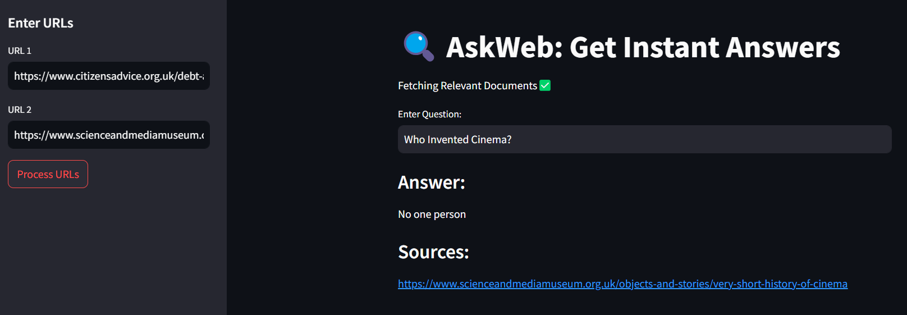

# ASKWEB : Get Instant Answers

AskWeb is a web-based platform built with **Streamlit** that integrates with **Question Answering LLM models** to provide real-time, accurate answers to user queries. Users can type their questions, and the system will process them through a powerful LLM to return relevant, context-based information from the web.

## Features

- **Interactive Web Interface**: Built with Streamlit for a smooth, real-time Q&A experience.
- **Question Answering with LLM**: Uses advanced language models to understand and respond to a variety of questions.
- **Real-time Answers**: Retrieves and presents answers based on up-to-date data, processed by LLMs for accuracy and clarity.

### Prerequisites

- Python 3.8+
- Streamlit
- Hugging Face Transformers (or any other library that supports question-answering models)
